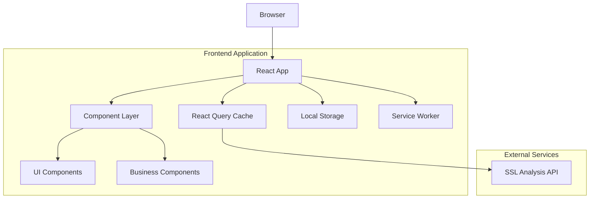

# Design Document

## Overview

The SSL Security Analysis Dashboard is a modern React-based web application that transforms complex SSL/TLS security data into an intuitive, actionable interface. The application follows a component-driven architecture with JavaScript and JSDoc for documentation, Tailwind CSS for consistent styling, and React Query for efficient API state management. The design emphasizes performance, accessibility, and responsive user experience across all device types.

## Architecture

### High-Level Architecture



### Technology Stack

- **Framework**: React 18+ with JavaScript and JSDoc for documentation and modern React features
- **Styling**: Tailwind CSS with Headless UI for consistent, accessible components
- **State Management**: React Query (TanStack Query) for server state and caching
- **Charts**: Recharts for responsive, customizable data visualizations
- **Icons**: Heroicons for consistent iconography
- **Build Tool**: Vite for fast development and optimized production builds
- **HTTP Client**: Axios with interceptors for API communication
- **PWA**: Service Worker for offline capabilities and caching

### Project Structure

```
src/
├── components/
│   ├── ui/              # Reusable UI components (Button, Card, Modal)
│   ├── dashboard/       # Dashboard-specific components
│   ├── analysis/        # Analysis result components
│   ├── charts/          # Chart components
│   └── common/          # Shared components (Header, Footer, Layout)
├── hooks/               # Custom React hooks
├── services/            # API service functions
├── types/               # JSDoc type definitions and constants
├── utils/               # Utility functions
├── styles/              # Global styles and Tailwind config
├── pages/               # Page components
└── assets/              # Static assets (images, icons)
```

## Components and Interfaces

### Core Data Types

```javascript
/**
 * @typedef {Object} SSLAnalysisResult
 * @property {boolean} success
 * @property {string} domain
 * @property {string} timestamp
 * @property {string} analysisTime
 * @property {Object} data
 * @property {SSLSecurityData} data.sslSecurity
 * @property {CertificateTransparencyData} data.certificateTransparency
 * @property {SecuritySummary} summary
 */

/**
 * @typedef {Object} SSLSecurityData
 * @property {string} host
 * @property {string} status
 * @property {SSLEndpoint[]} endpoints
 * @property {Certificate[]} certs
 */

/**
 * @typedef {Object} SecuritySummary
 * @property {string} overallGrade
 * @property {string[]} securityIssues
 * @property {string[]} recommendations
 * @property {string} certificateStatus
 */

/**
 * @typedef {Object} CertificateTransparencyData
 * @property {string} domain
 * @property {Object} summary
 * @property {number} summary.totalCertificates
 * @property {number} summary.activeCertificates
 * @property {number} summary.expiredCertificates
 * @property {number} summary.discoveredSubdomains
 * @property {Object} certificates
 * @property {Certificate[]} certificates.active
 * @property {Certificate[]} certificates.recent
 */
```

### Component Architecture

#### 1. Layout Components

**AppLayout Component**
- Responsive container with header, main content, and footer
- Theme provider for dark/light mode switching
- Error boundary for graceful error handling
- Loading overlay for global loading states

**Header Component**
- Brand logo and navigation
- Theme toggle switch
- Responsive hamburger menu for mobile
- Gradient background with subtle animations

#### 2. Dashboard Components

**DomainSearchForm Component**
- Large search input with domain validation
- Auto-complete suggestions from search history
- Loading states with animated SSL certificate icon
- Example domain suggestions as placeholders

```javascript
/**
 * @typedef {Object} DomainSearchFormProps
 * @property {function(string): void} onSubmit
 * @property {boolean} isLoading
 * @property {string[]} recentSearches
 */
```

**SecurityOverviewCards Component**
- Grid layout of key security metrics
- SecurityGradeCard, CertificateStatusCard, VulnerabilitiesCard
- Responsive grid that adapts to screen size
- Animated counters and progress indicators

#### 3. Analysis Result Components

**SecurityGradeCard Component**
- Large, prominent grade display with color coding
- Animated circular progress ring
- Grade explanation tooltip
- Comparison with industry standards

```javascript
/**
 * @typedef {Object} SecurityGradeCardProps
 * @property {string} grade
 * @property {boolean} hasWarnings
 * @property {boolean} isExceptional
 * @property {SSLEndpoint[]} endpoints
 */
```

**CertificateStatusCard Component**
- Certificate validity status with visual indicators
- Countdown timer for expiration
- Certificate authority information
- Certificate type badges (DV, OV, EV)

**VulnerabilitiesCard Component**
- Vulnerability count with severity breakdown
- Top 3 critical issues with descriptions
- Security recommendations list
- "View All" expandable section

#### 4. Detailed Analysis Components

**SSLDetailsPanel Component**
- Tabbed interface with Endpoints, Certificate, and Security tabs
- Endpoints tab: IP addresses, protocols, cipher suites table
- Certificate tab: Certificate chain visualization, public key info
- Security tab: Vulnerability scan results, security headers

**CertificateTransparencyPanel Component**
- Overview tab: Certificate statistics and timeline chart
- Subdomains tab: Discovered subdomains with security status
- Timeline tab: Certificate issuance history with interactive charts

#### 5. Visualization Components

**SecurityScoreGauge Component**
- Animated circular gauge using Recharts
- Color-coded score ranges
- Smooth animations and transitions

**CertificateTimeline Component**
- Interactive timeline chart showing certificate history
- Hover tooltips with detailed information
- Zoom and pan functionality for large datasets

**VulnerabilityHeatmap Component**
- Visual representation of security issues
- Color-coded severity levels
- Interactive hover states with details

## Data Models

### API Integration Layer

**SSLAnalysisService**
```javascript
class SSLAnalysisService {
  constructor() {
    this.baseURL = process.env.REACT_APP_API_URL || 'http://localhost:9000';
  }
  
  /**
   * Analyze SSL for a domain
   * @param {string} domain - Domain to analyze
   * @returns {Promise<SSLAnalysisResult>} Analysis results
   */
  async analyzeDomain(domain) {
    const response = await axios.get(`${this.baseURL}/analyze/${domain}`);
    return response.data;
  }
  
  /**
   * Get API health status
   * @returns {Promise<HealthStatus>} Health status
   */
  async getHealthStatus() {
    const response = await axios.get(`${this.baseURL}/health`);
    return response.data;
  }
}
```

**React Query Integration**
```javascript
export const useSSLAnalysis = (domain) => {
  return useQuery({
    queryKey: ['ssl-analysis', domain],
    queryFn: () => sslAnalysisService.analyzeDomain(domain),
    enabled: !!domain,
    staleTime: 5 * 60 * 1000, // 5 minutes
    retry: 2,
  });
};
```

### Local Storage Management

**AnalysisHistoryService**
```javascript
/**
 * @typedef {Object} AnalysisHistory
 * @property {string} domain
 * @property {string} timestamp
 * @property {string} grade
 * @property {'success'|'error'} status
 */

class AnalysisHistoryService {
  constructor() {
    this.storageKey = 'ssl-analysis-history';
  }
  
  /**
   * Save analysis to history
   * @param {AnalysisHistory} analysis
   */
  saveAnalysis(analysis) {
    // Implementation
  }
  
  /**
   * Get recent analyses
   * @param {number} limit
   * @returns {AnalysisHistory[]}
   */
  getRecentAnalyses(limit = 10) {
    // Implementation
  }
  
  /**
   * Clear analysis history
   */
  clearHistory() {
    // Implementation
  }
}
```

## Error Handling

### Error Boundary Implementation

```javascript
class AnalysisErrorBoundary extends React.Component {
  // Catches JavaScript errors in component tree
  // Displays fallback UI with retry options
  // Logs errors for debugging
}
```

### API Error Handling

- **Network Errors**: Display offline indicator with retry button
- **Timeout Errors**: Show timeout message with option to extend wait time
- **Domain Not Found**: Provide domain suggestions and format validation
- **Rate Limiting**: Display rate limit message with retry countdown
- **Server Errors**: Show generic error with support contact information

### Loading States

- **Skeleton Loaders**: For all major components during initial load
- **Progressive Loading**: Show partial results as they become available
- **Step Indicators**: Display analysis progress (Connecting → Analyzing → Processing)
- **Animated Icons**: SSL certificate icon with rotation during analysis

## Testing Strategy

### Unit Testing
- **Component Testing**: React Testing Library for component behavior
- **Hook Testing**: Custom hooks with mock API responses
- **Utility Testing**: Pure functions for data transformation
- **Service Testing**: API service methods with mocked responses

### Integration Testing
- **API Integration**: Test complete analysis flow with real API
- **User Workflows**: End-to-end user journeys from search to results
- **Responsive Testing**: Component behavior across different screen sizes
- **Accessibility Testing**: Screen reader compatibility and keyboard navigation

### Performance Testing
- **Load Time Testing**: Measure initial page load and component rendering
- **Memory Usage**: Monitor for memory leaks in long-running sessions
- **Bundle Size Analysis**: Optimize bundle size with code splitting
- **API Response Caching**: Verify React Query caching behavior

### Visual Testing
- **Storybook Integration**: Component library with visual regression testing
- **Cross-browser Testing**: Ensure consistency across major browsers
- **Theme Testing**: Verify dark/light mode switching
- **Mobile Testing**: Touch interactions and responsive layouts

## Design System

### Color Palette
```css
:root {
  --color-primary: #3B82F6;      /* Blue-500 */
  --color-secondary: #10B981;    /* Emerald-500 */
  --color-success: #22C55E;      /* Green-500 */
  --color-warning: #F59E0B;      /* Amber-500 */
  --color-error: #EF4444;        /* Red-500 */
  --color-background: #F8FAFC;   /* Slate-50 */
  --color-card: #FFFFFF;         /* White */
  --color-text-primary: #1E293B; /* Slate-800 */
  --color-text-secondary: #64748B; /* Slate-500 */
  --color-border: #E2E8F0;       /* Slate-200 */
}
```

### Typography Scale
- **Headings**: Inter font, weights 600-700
- **Body Text**: Inter font, weights 400-500
- **Code/Monospace**: JetBrains Mono for technical data
- **Responsive Scaling**: Fluid typography using clamp() functions

### Component Variants
- **Buttons**: Primary, secondary, outline, ghost variants
- **Cards**: Default, elevated, bordered variants
- **Badges**: Status badges for certificates, vulnerabilities, grades
- **Alerts**: Success, warning, error, info variants

### Animation Guidelines
- **Micro-interactions**: Hover states, button clicks, form interactions
- **Page Transitions**: Smooth transitions between analysis states
- **Data Loading**: Skeleton animations and progress indicators
- **Chart Animations**: Smooth data transitions and hover effects

## Responsive Design Strategy

### Breakpoint System
```css
/* Mobile First Approach */
@media (min-width: 640px) { /* sm */ }
@media (min-width: 768px) { /* md */ }
@media (min-width: 1024px) { /* lg */ }
@media (min-width: 1280px) { /* xl */ }
```

### Layout Adaptations
- **Desktop (1024px+)**: 3-column layout with sidebar navigation
- **Tablet (768px-1023px)**: 2-column layout with collapsible sections
- **Mobile (320px-767px)**: Single column with bottom sheet modals

### Touch Interactions
- **Minimum Touch Targets**: 44px for all interactive elements
- **Swipe Gestures**: Horizontal swipe for tab navigation
- **Pull-to-Refresh**: Refresh analysis results on mobile
- **Long Press**: Context menus for additional actions

## Performance Optimization

### Code Splitting
```javascript
// Lazy load heavy components
const CertificateTransparencyPanel = lazy(() => 
  import('./components/analysis/CertificateTransparencyPanel')
);

const ChartComponents = lazy(() => 
  import('./components/charts')
);
```

### Caching Strategy
- **React Query**: 5-minute cache for analysis results
- **Service Worker**: Cache static assets and API responses
- **Local Storage**: Persist user preferences and search history
- **CDN**: Serve static assets from CDN for global performance

### Bundle Optimization
- **Tree Shaking**: Remove unused code from final bundle
- **Code Splitting**: Split by routes and heavy components
- **Dynamic Imports**: Load chart libraries only when needed
- **Asset Optimization**: Compress images and optimize fonts

This design provides a comprehensive foundation for building a professional, scalable SSL Security Analysis Dashboard that meets all the specified requirements while maintaining excellent user experience and performance characteristics.